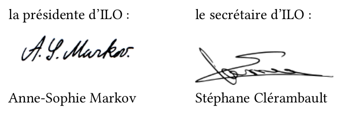

# Statuts de l'association ILO

**ILO est une association culturelle espérantiste locale  
 indépendante de toute organisation politique ou syndicale**

## Préambule

**ILO** est constitué de sympathisants espérantistes pour former une association culturelle locale et indépendante de toute organisation politique ou syndicale.

## Article 1. Fondation

Le 1er décembre 2003, il est fondé, entre les adhérents aux présents statuts, une association régie par la loi du 1er juillet 1901 et le décret du 16 août 1901 ayant pour titre **ILO**.

Les statuts initiaux sont mis à jour le 8 septembre 2017.

## Article 2. Buts

Cette association a pour buts :

- d'organiser l'apprentissage et/ou la pratique de l'espéranto pour ses membres ;
- d'impulser un jumelage avec une ville possédant un club ou une association d'espéranto ;
- d'établir des rencontres entre les espérantistes des communes environnantes, sympathisants, débutants ou confirmés ;
- de favoriser des contacts nationaux ou internationaux ;
- de promouvoir l'espéranto.

## Article 3. Siège social

Le siège social de l'association est fixé à :

>      Association ILO, chez Anne-Sophie Markov
>      61 boulevard Vauban
>      78180 Montigny-le-Bretonneux

Il pourra être transféré par simple décision du bureau ; la ratification par l'assemblée générale sera nécessaire.

## Article 4. Durée

La durée de l'association est illimitée.

## Article 5. Composition

L'association se compose de membres adhérents, de membres honoraires et de membres bienfaiteurs.

## Article 6. Radiation

La qualité de membre se perd :

- par démission ;
- pour motif grave ; la radiation est alors prononcée par le bureau, l'intéressé ayant été invité à se présenter devant le bureau pour fournir des explications.

## Article 7. Ressources

Les ressources de l'association comprennent :

- les montants des cotisations et des dons ;
- les subventions des communes, de l'État et des collectivités locales ;
- l’excédent financier des congrès organisés par ILO.

## Article 8. Dépenses

Les dépenses sont ordonnancées par le bureau.

## Article 9. Bureau

L'association est dirigée par un bureau composé au moins d'un **président**, d'un **trésorier** et d'un **secrétaire**. Les membres du bureau sont élus par l'assemblée générale pour un an et sont rééligibles.

En cas de vacance d'un ou plusieurs de ses membres, le bureau pourvoit provisoirement à son ou à leur remplacement jusqu'à la prochaine assemblée générale.

## Article 10. Fonctionnement du bureau

Le bureau se réunit au moins une fois par an sur l'initiative du président.

## Article 11. Assemblée générale

Le bureau convoque les assemblées générales au moins une fois par an.

L'assemblée générale de début d'année scolaire est ouverte à tous les membres adhérents : elle est aussi ouverte au public sans toutefois que les non-adhérents puissent prendre part aux votes. Le bureau présente les bilans moral et financiers de l'association et les soumet à l'approbation de l'assemblée qui vote en outre le montant de la cotisation pour l'année scolaire qui débute. Il est procédé, après épuisement de l'ordre du jour, au remplacement, au scrutin secret si les membres le souhaitent, des membres du bureau sortant.

Les membres de l'association sont convoqués par les soins du secrétaire. L'ordre du jour accompagne la convocation et chaque membre a la possibilité de donner pouvoir à un membre présent. Le quorum est fixé au quart des adhérents ; si le quorum n'est pas atteint, une seconde convocation sera envoyée, pour une nouvelle assemblée sans quorum. Le vote est acquis à la majorité des présents ou des représentés. Un compte-rendu sera disponible pour tous les membres.

## Article 12. Règlement intérieur

Un règlement intérieur peut être établi par le bureau qui le fait approuver par l'assemblée générale. Ce règlement est destiné à fixer divers points non prévus par les statuts, notamment ceux qui ont trait à l'administration interne de l'association.

## Article 13. Dissolution

En cas de demande de dissolution, le bureau convoque une assemblée générale extraordinaire de dissolution, dont le quorum est fixé à la moitié des membres actifs. La dissolution doit être prononcée par au moins les deux tiers des membres présents et représentés de l'association. Si le quorum n'est pas atteint une seconde convocation sera envoyée pour une nouvelle assemblée générale extraordinaire sans quorum. Le vote est acquis à la majorité des présents et représentés.

La destination des actifs de l'association fera l'objet d'un vote.

Le 8 septembre 2017,

